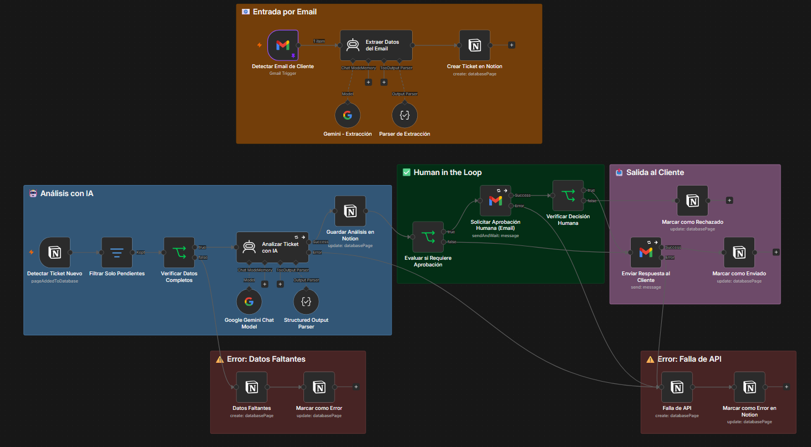
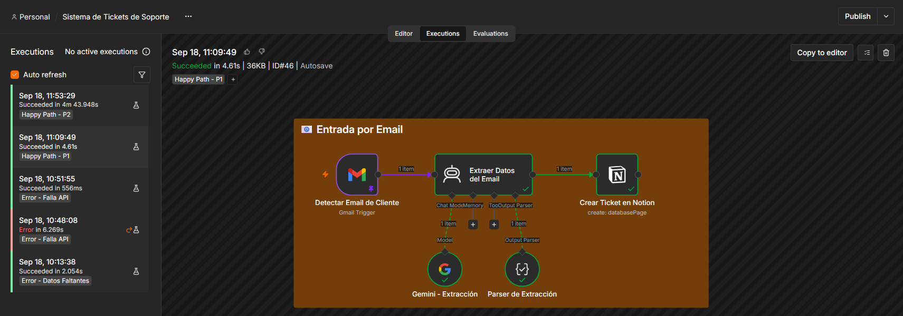
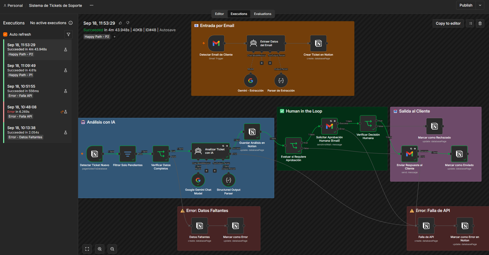
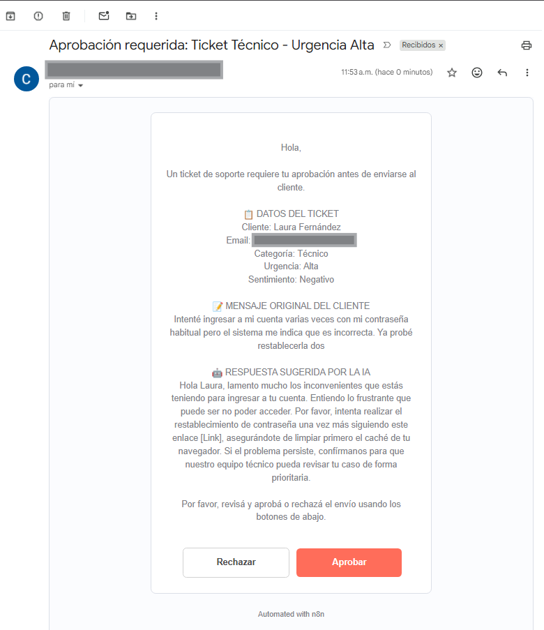
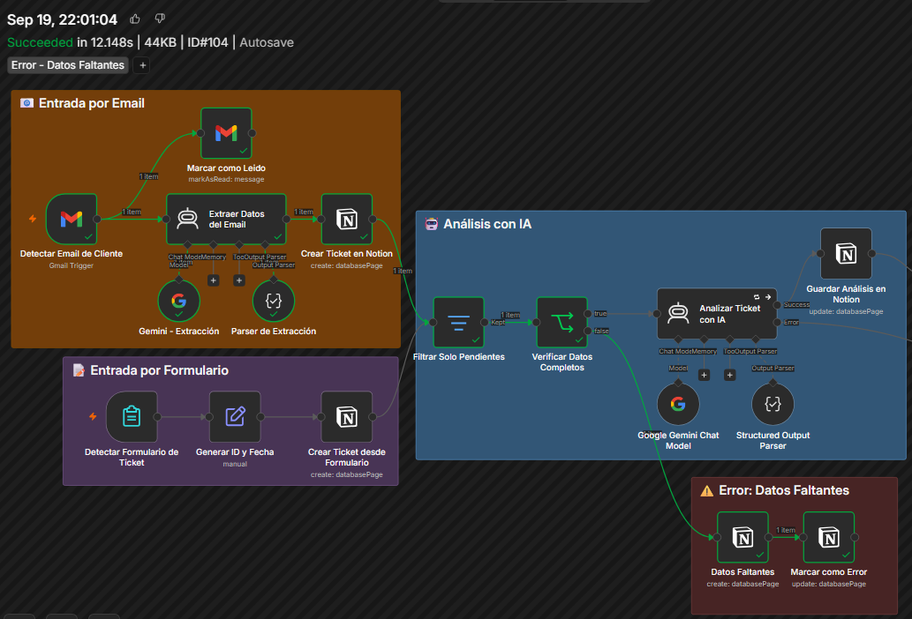
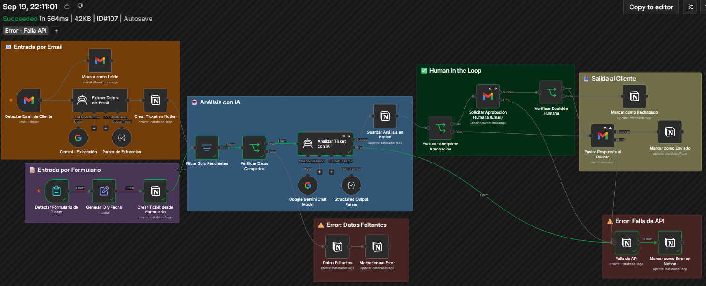

# Ecosistema de Automatización IA — Triage de Tickets de Soporte

Sistema autónomo de triage de tickets de soporte técnico, construido con n8n, Notion y un LLM (Google Gemini), con un punto de validación humana (Human-in-the-Loop) antes de responder al cliente.

---

## 📌 Caso de uso

Este sistema resuelve el triage automático de tickets de soporte técnico para **NubeSoft** (cliente ficticio), una empresa de software en la nube para gestión y facturación. NubeSoft recibe muchas consultas diarias de sus clientes por problemas de acceso, cobros y cancelaciones, y necesitaba un sistema que clasifique automáticamente cada reclamo, redacte una respuesta y evite que un error de la IA llegue sin revisión a un cliente real.

Los tickets ingresan por email o se cargan directamente en Notion. La IA los clasifica (categoría, urgencia, sentimiento) y solo se envía una respuesta al cliente después de que una persona la aprueba, cuando la urgencia es Alta o Crítica.

---

## 🧩 Stack utilizado

| Componente | Herramienta |
|---|---|
| Orquestador | n8n |
| Base de datos / memoria | Notion |
| Procesamiento IA (LLM) | Google Gemini (`gemini-3.1-flash-lite`) |
| Canal de entrada | Gmail |
| Canal de salida | Gmail |
| Human-in-the-loop | Gmail (nodo de espera de aprobación) |

---

## 🗺️ Mapa de Arquitectura del Sistema

📄 [Ver diagrama completo (PDF)](./docs/arquitectura.pdf)



**Resumen del flujo:**

El sistema tiene dos formas de recibir tickets nuevos, que terminan alimentando la misma lógica:

1. **Entrada por Email**: un nodo detecta un correo nuevo del cliente. Un agente de IA lee ese correo y saca el nombre del cliente, el asunto y el mensaje limpio (sin saludos ni firmas), y con eso crea el ticket en Notion con estado `Pendiente`.
2. **Entrada Manual**: otro nodo revisa cada minuto si apareció una página nueva en la base de Tickets de Notion (por ejemplo, si alguien la cargó a mano).
3. **Filtro de estado**: un nodo descarta cualquier ticket que no esté en estado `Pendiente`, para no volver a procesar algo que ya se atendió.
4. **Chequeo de datos**: un nodo revisa que el ticket tenga un mensaje cargado; si no lo tiene, lo manda por un camino separado que registra el problema sin frenar el resto del sistema.
5. **Análisis con IA**: un agente de IA clasifica el ticket en Categoría, Urgencia y Sentimiento, y escribe una respuesta sugerida. Todo esto se guarda en el mismo ticket dentro de Notion.
6. **Punto de aprobación**: si la urgencia es `Alta` o `Crítica`, el sistema manda un correo pidiendo aprobación humana y espera la respuesta antes de seguir. Si la urgencia es Baja o Media, sigue directo, sin pedir aprobación.
7. **Respuesta al cliente**: se manda la respuesta por Gmail y se actualiza el estado del ticket en Notion (`Enviado` o `Rechazado`, según lo que haya decidido la persona).

---

## 🧠 Manual Operativo de Estructuras de Datos

### Esquema de la base de Notion

**Tabla "Tickets"** (base principal, la que dispara el flujo en n8n)

| Propiedad | Tipo | Descripción |
|---|---|---|
| Título | Title | ID generado automáticamente, formato `TCK-{fechahora}` |
| Asunto | Texto | Asunto del ticket, extraído del correo o generado por la IA |
| Mensaje Original | Texto | El reclamo del cliente, ya limpio de saludos y firmas |
| Nombre Cliente | Texto | Extraído del email, o completado a mano si hace falta |
| Email Cliente | Email | Dirección de contacto del cliente |
| Fecha Recepción | Fecha | Momento en que se creó el ticket |
| Estado | Select | `Pendiente` → `Procesado por IA` → `Enviado` / `Rechazado` / `Error` |
| Categoria | Select | `Técnico` / `Facturación` / `Cancelación` / `Consulta General` |
| Urgencia | Select | `Baja` / `Media` / `Alta` / `Crítica` |
| Sentimiento | Select | `Positivo` / `Neutral` / `Negativo` |
| Respuesta Sugerida IA | Texto | Borrador de respuesta que genera la IA |

**Tabla "Log de Errores"** (relacionada con Tickets)

| Propiedad | Tipo | Descripción |
|---|---|---|
| Título | Title | ID generado automáticamente, formato `ERR-{fechahora}` |
| Tipo de Error | Select | `Datos faltantes` / `API caída` |
| Detalle | Texto | Descripción de qué pasó |
| Fecha | Fecha | Cuándo ocurrió el error |
| Ticket Relacionado | Relation | Link al ticket de la tabla Tickets al que corresponde este error |

### Esquemas JSON de las principales integraciones

**1. Email → Extracción de datos** (agente "Extraer Datos del Email")

Esto es lo que devuelve la IA después de leer un correo entrante:
```json
{
  "nombre_cliente": "Laura Fernández",
  "asunto": "No puede acceder a su cuenta",
  "mensaje_original": "Intenté ingresar a mi cuenta varias veces con mi contraseña habitual pero el sistema me indica que es incorrecta..."
}
```

**2. Creación de ticket en Notion** (nodo "Crear Ticket en Notion")
```json
{
  "resource": "databasePage",
  "title": "TCK-20260918143200",
  "properties": {
    "Asunto": "No puede acceder a su cuenta",
    "Mensaje Original": "Intenté ingresar a mi cuenta varias veces...",
    "Nombre Cliente": "Laura Fernández",
    "Email Cliente": "laura@example.com",
    "Fecha Recepción": "2026-09-18T14:32:00-03:00",
    "Estado": "Pendiente"
  }
}
```

**3. Análisis de IA → Notion** (agente "Analizar Ticket con IA")
```json
{
  "Categoria": "Técnico",
  "Urgencia": "Alta",
  "Sentimiento": "Negativo",
  "respuesta_sugerida": "Hola Laura, lamentamos el inconveniente con el acceso a tu cuenta..."
}
```

**4. Respuesta final al cliente** (nodo "Enviar Respuesta al Cliente")
```json
{
  "sendTo": "={{ Email Cliente }}",
  "subject": "Respuesta a tu consulta - {{ Asunto }}",
  "message": "={{ Respuesta Sugerida IA }}"
}
```

---

## 💰 Estrategia de Optimización de Costos y Recursos

### Por qué se eligió Gemini y no GPT o Claude

La primera decisión pensada para ahorrar costos fue el propio motor de IA. La consigna original sugería usar OpenAI o Anthropic, que son de pago desde el primer uso. En cambio, se optó por **Google Gemini**, que tiene una versión gratuita a través de Google AI Studio, con un límite de uso más que suficiente para el volumen de tickets de una empresa como NubeSoft. Así se evita gastar dinero mientras el proyecto está en fase de prueba, sin perder la calidad del prompt ni la lógica de agentes que pide la consigna.

### Cuadro comparativo por tarea

| Tarea | Modelo elegido | ¿Qué tan compleja es la tarea? | Por qué se eligió este modelo |
|---|---|---|---|
| Extracción de datos del email | `gemini-3.1-flash-lite` | Baja — solo separa nombre, asunto y mensaje de un texto | Es una tarea simple y repetitiva (se ejecuta con cada correo que llega). Un modelo liviano es más rápido y no hace falta gastar en uno más potente. |
| Análisis y clasificación del ticket | `gemini-3.1-flash-lite` | Media — tiene que entender el tono del mensaje y armar una respuesta | Aunque es un poco más exigente que la extracción, sigue siendo una clasificación entre pocas opciones fijas (4 categorías, 4 urgencias, 3 sentimientos). Un modelo más grande no mejoraría mucho el resultado, pero sí subiría el costo. |

**Matriz de decisión:**

| Situación | ¿Conviene un modelo económico? | ¿Conviene un modelo más potente (GPT-4o, Claude)? |
|---|---|---|
| Tarea simple y repetitiva, mucho volumen (como la extracción) | ✅ Sí, es lo que se usó | No hace falta, sería gastar de más |
| Clasificación entre opciones ya definidas | ✅ Sí, es lo que se usó | No mejora demasiado el resultado |
| Leer documentos largos y complejos, o tomar decisiones de mucho riesgo | Puede no alcanzar | ✅ Ahí sí se justifica pagar más |

En este proyecto, ninguna de las dos tareas de IA necesita leer documentos largos ni tomar decisiones muy riesgosas, así que las dos quedaron cubiertas con el modelo gratuito, sin resignar calidad.

### ¿Por qué no se usó la API de Batches?

La API de Batches sirve para mandar muchas solicitudes de una sola vez a cambio de un descuento, pero la respuesta puede tardar horas en llegar. Este sistema necesita responder rápido: un cliente escribe un ticket y espera una respuesta en minutos, y la persona que aprueba el envío necesita ver el análisis de la IA enseguida, no horas después. Por eso no tiene sentido usar Batches acá.

Donde sí tendría sentido usar Batches, dentro de este mismo proyecto, es en una tarea que no dependa de que un cliente esté esperando: por ejemplo, un proceso que corra de noche y vuelva a analizar todos los tickets cerrados del día para armar un reporte de calidad, o que reclasifique tickets viejos si se agrega una categoría nueva al sistema. Como en esos casos nadie está esperando la respuesta en el momento, se podría mandar todo junto y ahorrar con Batches.

---

## 🛡️ Malla de Seguridad, Privacidad y Resiliencia

### Minimización de datos

El sistema guarda en Notion solo lo necesario para resolver el ticket:

**Se guarda:**
- El nombre del cliente (cuando se puede identificar en el correo)
- El email de contacto (para poder responderle)
- El asunto y el mensaje del reclamo, ya limpios de saludos y firmas
- La clasificación que hizo la IA (categoría, urgencia, sentimiento) y la respuesta sugerida
- Los datos del error, si hubo alguno (tipo de error, detalle y fecha)

**No se guarda:**
- El correo completo tal cual llega, con toda la información técnica extra que trae un email (como quién lo reenvió, en qué hilo de conversación está, o el formato interno del mensaje) — solo se queda con las tres cosas que realmente hacen falta: nombre, asunto y mensaje.
- Datos de pago o de tarjetas: el sistema no pide ni procesa esa información. El prompt de la IA que extrae los datos está armado para no inventar campos que no estén definidos, así que aunque un cliente escriba un número de tarjeta por error, ese dato no se termina guardando como si fuera información estructurada del sistema.
- El detalle de cada intento fallido cuando una API falla: solo se guarda el mensaje del error final, no cada reintento individual.

La idea general es guardar lo mínimo posible para que el sistema funcione, y no acumular información de más que no se vaya a usar.

### Manejo de errores

El flujo tiene dos caminos separados para cuando algo sale mal, y en los dos casos el error queda registrado sin frenar el resto del sistema:

- **Error: Datos Faltantes** — pasa cuando un ticket llega sin el mensaje del cliente cargado, que es el dato mínimo que la IA necesita para poder analizarlo. En ese caso, el sistema ni siquiera llama a la IA (para no gastar de más en un dato que ya sabemos que está incompleto): registra el problema en la tabla de errores, lo vincula al ticket correspondiente, y marca ese ticket como "Error" para que alguien lo revise a mano más tarde.

- **Error: Falla de API** — pasa cuando falla la llamada a Gemini o a Gmail (por ejemplo, si la cuota se agotó o el servicio no respondió a tiempo). Los nodos más importantes están configurados para reintentar automáticamente 3 veces antes de darse por vencidos, así se cubren los fallos pasajeros de conexión. Si después de esos 3 intentos sigue sin funcionar, el sistema no se detiene: registra el error con el detalle real de lo que pasó, y marca el ticket como "Error", igual que en el otro caso.

En ambos casos, la idea es que un problema puntual en un ticket no afecte a los demás: cada ticket se procesa por separado.

### Human-in-the-loop

El punto donde se pide aprobación humana se ubicó después de que la IA ya armó su clasificación y su respuesta, pero antes de que cualquier mensaje salga hacia el cliente — y solo para los casos de urgencia "Alta" o "Crítica" (cancelaciones, problemas de cobro, o problemas de acceso urgentes). Esta decisión responde a dos razones concretas:

1. **La IA puede equivocarse**: un LLM puede a veces generar una respuesta con el tono equivocado, o prometer algo que la empresa no puede cumplir (como un reembolso automático). Revisar esa respuesta antes de mandarla evita que ese error le llegue a un cliente real, sobre todo en los casos más delicados.
2. **Evitar respuestas automáticas en casos sensibles**: mandar respuestas sin que nadie las revise en reclamos como cancelaciones o disputas de cobro puede generar problemas si la respuesta automática no es del todo correcta.

Los tickets de urgencia Baja o Media, en cambio, se envían directo sin pedir aprobación, porque el riesgo de que algo salga mal en una consulta simple es mucho menor, y pedir revisión humana en todos los casos haría el sistema mucho más lento sin necesidad.

---

## 📊 Dashboard de Control Ejecutivo

🔗 [Ver vista pública de Notion](https://guttural-bronze-77e.notion.site/Sistema-de-Triage-de-Soporte-3daadc3ec10280a28abfed47d4bcb033)

Este panel permite que el dueño del negocio o el equipo de soporte vea en tiempo real cómo está funcionando el sistema, sin necesidad de entrar a n8n. Muestra:

- **Cuántos tickets hay en total** y en qué estado está cada uno (`Pendiente`, `Procesado por IA`, `Enviado`, `Rechazado`, `Error`), agrupados en un tablero visual para ver de un vistazo en qué etapa está cada ticket.
- **Cuántos tickets se resolvieron solos vs. cuántos necesitaron aprobación humana**, para entender qué tan seguido interviene una persona en el proceso.
- **Cuántos tickets tuvieron algún error**, separados por tipo (`Datos faltantes` o `API caída`), tomando esa información directo de la tabla de Log de Errores — esto ayuda a ver si los problemas vienen más de datos incompletos o de que algún servicio externo falla seguido.
- **Qué tipo de reclamos son los más comunes**, agrupando los tickets por Categoría y Urgencia, para que el negocio pueda ver en qué área conviene mejorar (por ejemplo, si la mayoría de los reclamos son de facturación).

> Estas métricas se arman directamente con las vistas que ya trae Notion (tableros, agrupaciones y filtros) sobre la misma base que usa el flujo de n8n — no hizo falta armar un panel aparte, así se mantiene todo dentro de las mismas herramientas gratuitas del proyecto.

---

## 🖼️ Evidencia de Ejecución

### ✅ Happy Path — Entrada por Email
Ejecución exitosa disparada por el Gmail Trigger: extracción de datos, creación del ticket en Notion y análisis con IA.


### ✅ Happy Path — Flujo completo (Notion)
Ejecución completa de punta a punta: desde la detección del ticket hasta la respuesta final al cliente, pasando por el punto de aprobación humana.


### 📧 Human-in-the-loop — Email de aprobación
Correo de aprobación enviado antes de responder al cliente, con los datos del ticket, el mensaje original y la respuesta sugerida por la IA.


### ⚠️ Camino infeliz — Datos faltantes
Ejecución de prueba con un ticket sin mensaje: el sistema lo detecta y lo deriva a la ruta de error sin frenar el resto del flujo.


### ⚠️ Camino infeliz — Falla de API
Ejecución de prueba simulando una falla de API: el sistema registra el incidente en el Log de Errores.


---

## 📁 Contenido del repositorio

```
/docs
  arquitectura.pdf
  arquitectura.png
  sistema_de_tickets_de_soporte.json
  /screenshots
    happy-path-parte1.png
    happy-path-parte2.png
    aprobacion-por-gmail.png
    datos-faltantes-unhappy-path.png
    falla-api-unhappy-path.png
README.md
```

- 📄 [PDF de arquitectura](./docs/arquitectura.pdf)
- 🧩 [JSON del flujo de n8n](./docs/sistema_de_tickets_de_soporte.json)
- 🖼️ [Capturas de evidencia](./docs/screenshots)
